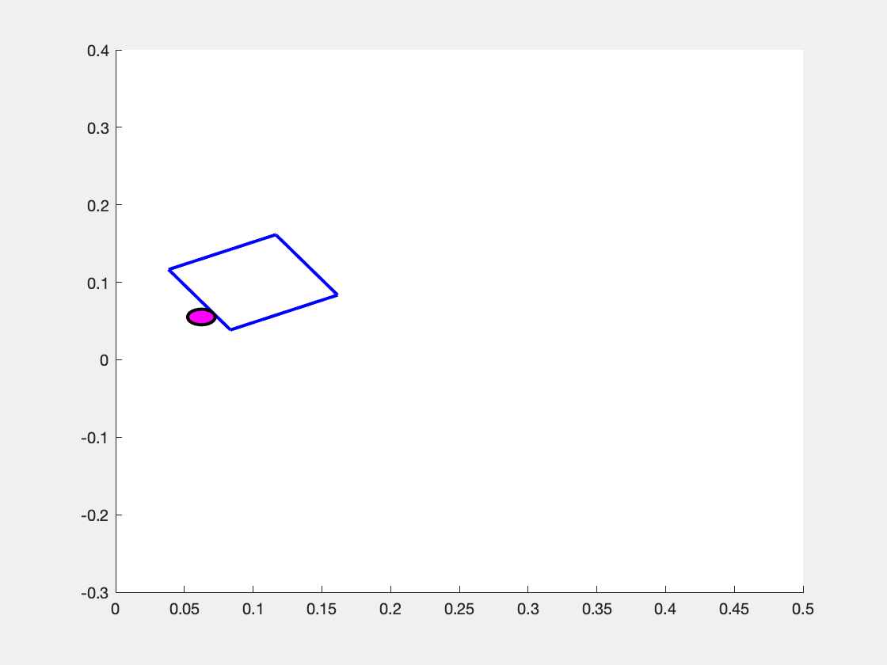
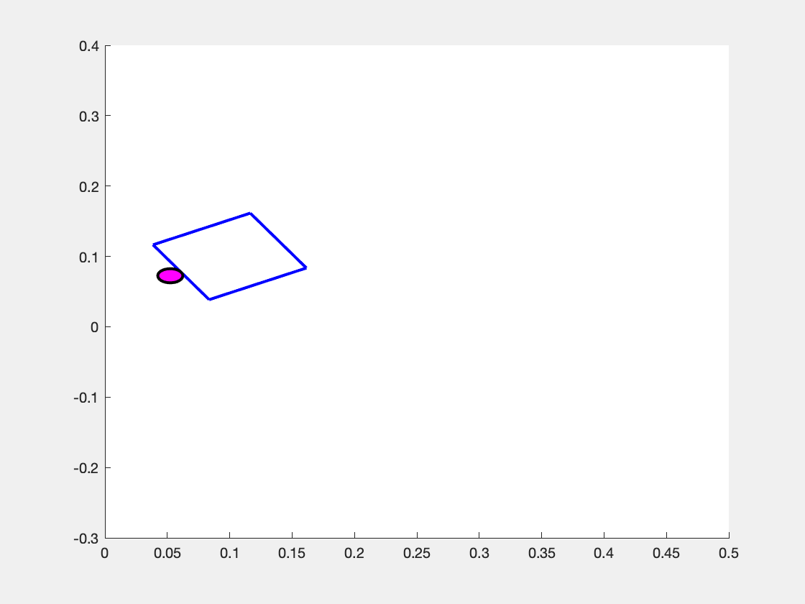
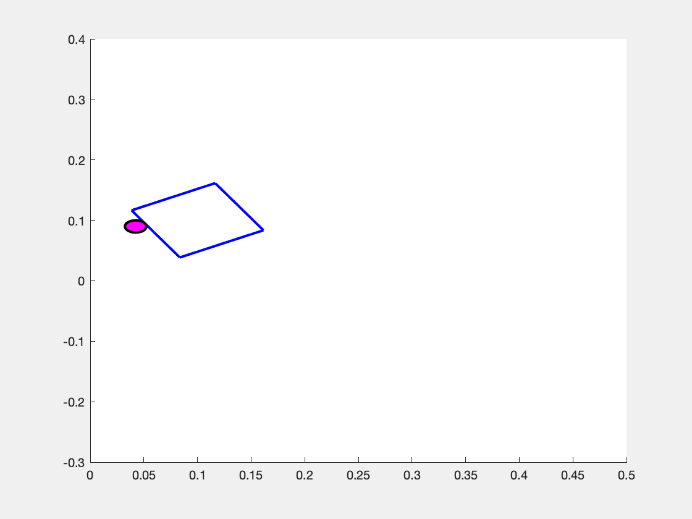

# systemRepository
This repository is meant to contain some definitions of systems in the MATLAB environment.

I hope to use it to easily create examples for future research papers/fun experiments.

## Pusher Slider

|  |  |  |
|:---------------------------------------------:|:-------------------------------------------:|:--------------------------------------------:|
| CCW Rotation of Block                         | No Rotation of Block                        | CW Rotation of Block                         |